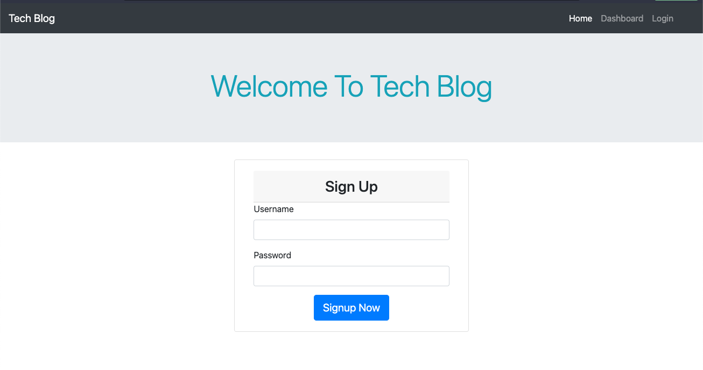

# Tech-Blog (MVC)

[](https://opensource.org/licenses/MIT)

## Description

This is a mysql database and CMS-style blog site that can publish articles, blog posts, and opinion pieces. Use Model View Controller paradigm.

## Table of Contents

- [Description](#description)
- [Installation](#installation)
- [Usage](#usage)
- [Screenshot](#screenshot)
- [Contact](#contact)

## Installation

```md
Run (npm install)
```

## Usage

Run (mysql -u root -p) and enter password when prompted and after that run (source db/schema.sql) and (quit) to exit from mysql. Then npm run seed to insert all the required data and finally run npm start command to start the apps.

# Screenshot



## Contact

Email: vancungthawng@outlook.com

Github: [Click Here!](https://github.com/vanjungthawng)
